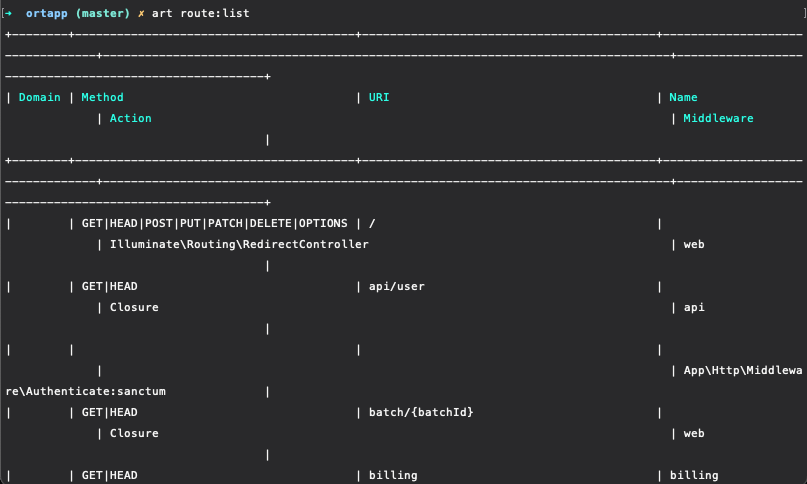
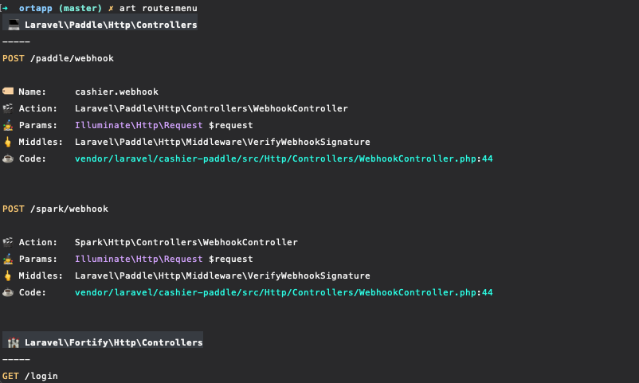

# Laravel Route Menu

Your `route:list`, sir.

[](https://packagist.org/packages/morrislaptop/laravel-route-menu)
[](https://github.com/morrislaptop/laravel-route-menu/actions?query=workflow%3ATests+branch%3Amaster)
[](https://github.com/morrislaptop/laravel-route-menu/actions?query=workflow%3A"Check+%26+fix+styling"+branch%3Amaster)
[](https://packagist.org/packages/morrislaptop/laravel-route-menu)


`route:list` isn't great on smaller terminals. 



`route-menu` gives you a beautiful route list which is friendly on smaller terminals and brings a few new features in.



Features:

* Shows all routes in a list view for smaller terminals
* Groups routes by namespace or filename for easy navigating
* Extracts parameters and their types
* Displays an IDE friendly file path for code jumping 🌟
* Extra support for `Route::redirect` and `Route::view` methods
* Additional `file` filter to only show relevant routes by filename / namespace
* Lots of 🏷️, 🎬, 🤹, 🖕, ☕️, 🏰, 🛫, 👀, ⚡, ☁️, 🌙, 🌅, 🔭, 💵, 🔐, 🛂, 👨‍🚀️

## Installation

You can install the package via composer:

```bash
composer require morrislaptop/laravel-route-menu --dev
```

## Usage

```php
php artisan route:menu
```

In addition to the `name`, `method` and `path` filters on `route:list`, an additional `file` filter is supported which will filter the routes based on the namespace (for classes) or file (for Closures).

```php
php artisan route:menu --file=app
```

## Testing

```bash
composer test
```

## Changelog

Please see [CHANGELOG](CHANGELOG.md) for more information on what has changed recently.

## Contributing

Please see [CONTRIBUTING](.github/CONTRIBUTING.md) for details.

## Security Vulnerabilities

Please review [our security policy](../../security/policy) on how to report security vulnerabilities.

## Credits

- [Craig Morris](https://github.com/morrislaptop)
- [All Contributors](../../contributors)

## License

The MIT License (MIT). Please see [License File](LICENSE.md) for more information.
